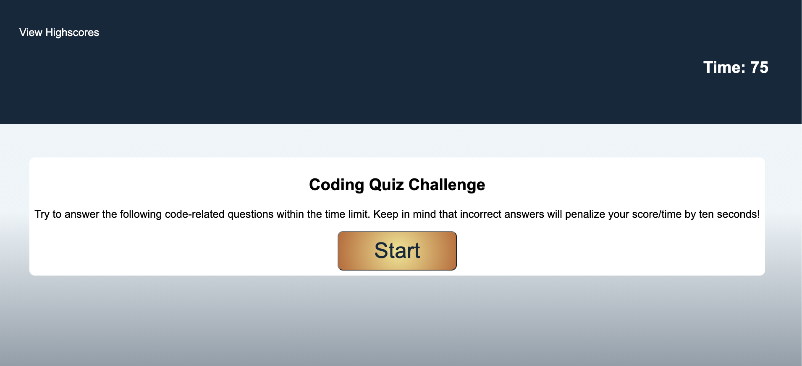

# Code Quiz

The following is a multiple-choice timed coding quiz. When the user starts the quiz, a timer starts and the user is presented with a question. When the user answers the question, the user is then presented with another question. If the user answers a question incorrectly, 20 seconds will be subtracted from the time. If the user answerts a question correctly, 20 seconds will be added on to their time. When all questions are answered or the timer reaches 0, the game is over. Then the game is over, the user can save their initials and score.

Link to Code Quiz: https://caitbopp.github.io/timed-quiz/

Preview of Code Quiz:
